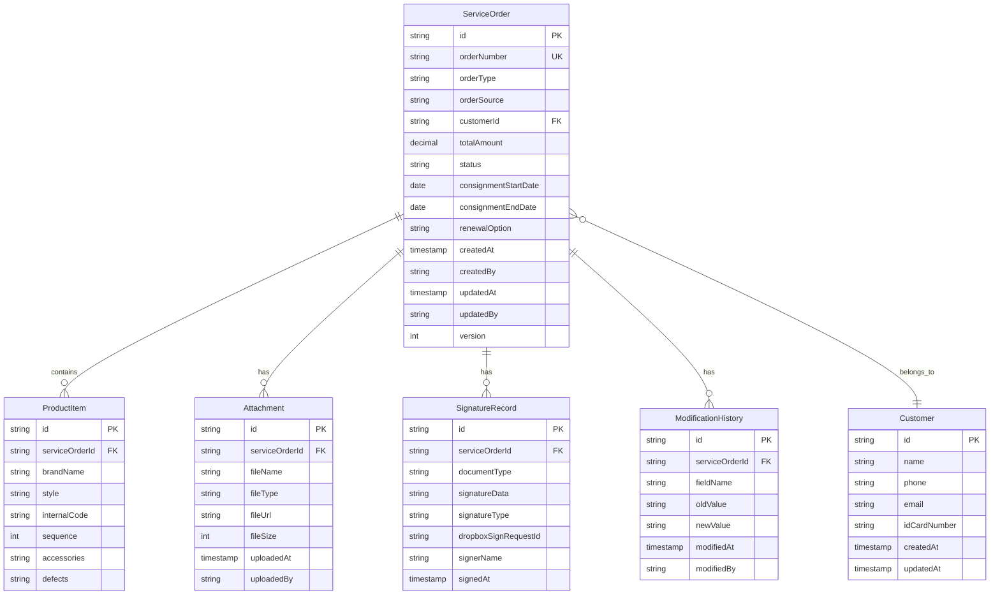

# Data Model: 服務單管理

**Date**: 2025-12-14  
**Feature**: 服務單管理（寄賣單與收購單）  
**Source**: 從 spec.md 功能需求中提取實體與關聯

---

## 實體總覽



---

## 詳細實體定義

### 1. ServiceOrder（服務單）

**用途**: 核心實體，代表收購單或寄賣單

**屬性**:

| 欄位名稱 | 型別 | 必填 | 說明 | 驗證規則 | 來源需求 |
|---------|------|------|------|---------|---------|
| `id` | UUID | ✅ | 唯一識別碼 | UUID v4 格式 | 系統自動生成 |
| `orderNumber` | String | ✅ | 服務單編號 | 格式：`{CS\|BS}YYYYMMDD{001-999}` | FR-009-1, FR-020-1 |
| `orderType` | Enum | ✅ | 服務單類型 | `CONSIGNMENT`（寄賣）或 `BUYBACK`（收購） | FR-001, FR-010 |
| `orderSource` | Enum | ✅ | 服務單來源 | `ONLINE`（線上）或 `OFFLINE`（線下） | FR-001, FR-010 |
| `customerId` | UUID | ✅ | 客戶 ID（外鍵） | 必須為有效的客戶 ID | FR-002, FR-011 |
| `totalAmount` | Decimal | ✅ | 總金額 | 正數，最多兩位小數 | FR-002, FR-011 |
| `status` | Enum | ✅ | 服務單狀態 | `PENDING`、`COMPLETED`、`TERMINATED` | FR-032 |
| `consignmentStartDate` | Date | ❌ | 寄賣起始日期（僅寄賣單） | ISO 8601 格式 | FR-012 |
| `consignmentEndDate` | Date | ❌ | 寄賣結束日期（僅寄賣單） | ISO 8601 格式，須晚於起始日期 | FR-012 |
| `renewalOption` | Enum | ❌ | 續約設定(僅寄賣單) | `AUTO_RETRIEVE`、`AUTO_DISCOUNT_10`、`DISCUSS` | FR-015 |
| `createdAt` | Timestamp | ✅ | 建立時間 | ISO 8601 格式（UTC） | FR-009, FR-020 |
| `createdBy` | String | ✅ | 建立者（使用者 ID） | - | FR-009, FR-020 |
| `updatedAt` | Timestamp | ❌ | 最後更新時間 | ISO 8601 格式（UTC） | FR-009, FR-020 |
| `updatedBy` | String | ❌ | 最後更新者（使用者 ID） | - | FR-009, FR-020 |
| `version` | Integer | ✅ | 版本號（樂觀鎖） | 初始值 0，每次更新 +1 | 並發控制 |

**續約設定選項**（`renewalOption`）:
- `AUTO_RETRIEVE`: 到期自動取回
- `AUTO_DISCOUNT_10`: 第三個月起自動調降 10%
- `DISCUSS`: 屆時討論

**狀態轉換規則**（FR-032）:
```typescript
PENDING → COMPLETED ✅
PENDING → TERMINATED ✅
COMPLETED → PENDING ✅
TERMINATED → (任何狀態) ❌ // 終態不可逆
```

---

### 2. ProductItem（商品項目）

**用途**: 代表服務單中的單一商品項目

**屬性**:

| 欄位名稱 | 型別 | 必填 | 說明 | 驗證規則 | 來源需求 |
|---------|------|------|------|---------|---------|
| `id` | UUID | ✅ | 唯一識別碼 | UUID v4 格式 | 系統自動生成 |
| `serviceOrderId` | UUID | ✅ | 服務單 ID（外鍵） | 必須為有效的服務單 ID | 關聯服務單 |
| `brandName` | String | ✅ | 品牌名稱 | 長度 1-100 字元 | FR-001, FR-010 |
| `style` | String | ✅ | 款式 | 長度 1-100 字元 | FR-001, FR-010 |
| `internalCode` | String | ❌ | 內碼 | 長度 0-50 字元 | FR-001, FR-010 |
| `sequence` | Integer | ✅ | 商品序號（顯示順序） | 範圍 1-4 | FR-042 |
| `accessories` | JSON | ❌ | 商品配件（僅寄賣單） | 陣列，可選值見下方說明 | FR-013 |
| `defects` | JSON | ❌ | 商品瑕疵處（僅寄賣單） | 陣列，可選值見下方說明 | FR-014 |

**商品配件選項**（`accessories`）:
```json
[
  "box",           // 盒子
  "dustBag",       // 防塵袋
  "purchaseProof", // 購證
  "shoppingBag",   // 提袋
  "shoulderStrap", // 肩帶
  "felt",          // 羊毛氈
  "pillow",        // 枕頭
  "card",          // 保卡
  "lockKey",       // 鎖頭/鑰匙
  "ribbon",        // 緞帶/花
  "brandCard",     // 品牌小卡
  "certificate",   // 保證書
  "none"           // 無
]
```

**商品瑕疵選項**（`defects`）:
```json
[
  "hardwareRustScratchLoss", // 五金生鏽/刮痕/掉
  "leatherWearScratchDent",  // 皮質磨損/刮痕/壓痕
  "liningDirty",             // 內裡髒污
  "cornerWear"               // 四角磨損
]
```

**約束條件**:
- 每個服務單必須包含 1-4 個商品項目（FR-042）
- `sequence` 必須唯一且連續（1, 2, 3, 4）
- 收購單的商品項目不包含 `accessories` 與 `defects` 欄位

---

### 3. Customer（客戶）

**用途**: 記錄客戶基本資訊

**屬性**:

| 欄位名稱 | 型別 | 必填 | 說明 | 驗證規則 | 來源需求 |
|---------|------|------|------|---------|---------|
| `id` | UUID | ✅ | 唯一識別碼 | UUID v4 格式 | 系統自動生成 |
| `name` | String | ✅ | 客戶姓名 | 長度 1-50 字元 | FR-024 |
| `phone` | String | ✅ | 電話號碼 | 台灣手機或市話格式 | FR-021, FR-024 |
| `email` | String | ❌ | Email | RFC 5322 格式 | FR-021, FR-024 |
| `idCardNumber` | String | ✅ | 身分證字號/識別碼 | 見下方說明 | FR-024, FR-024-1 |
| `createdAt` | Timestamp | ✅ | 建立時間 | ISO 8601 格式（UTC） | 系統自動生成 |
| `updatedAt` | Timestamp | ❌ | 最後更新時間 | ISO 8601 格式（UTC） | 系統自動生成 |

**身分證字號/識別碼驗證規則**（`idCardNumber`）:
- **台灣人士**: 台灣身分證格式（1 英文字母 + 9 數字），例如：A123456789
- **外籍人士**: 
  - 若有居留證統一證號，使用居留證號碼
  - 若居留證無統一證號或未領有居留證，使用「西元出生年月日(8位數字) + 英文姓名首字前2碼(大寫英文)」，總長度 10 位
  - 格式範例：19900115JO（1990年1月15日出生，姓名首字為 John）
- 長度限制：10-11 字元
- 必須唯一

**搜尋欄位**（FR-021）:
- 姓名（模糊搜尋）
- 電話號碼（精確搜尋）
- Email（模糊搜尋）
- 身分證字號（精確搜尋）

**唯一性約束**:
- `idCardNumber` 必須唯一

---

### 4. Attachment（附件）

**用途**: 儲存服務單相關文件（身分證明、合約文件等）

**屬性**:

| 欄位名稱 | 型別 | 必填 | 說明 | 驗證規則 | 來源需求 |
|---------|------|------|------|---------|---------|
| `id` | UUID | ✅ | 唯一識別碼 | UUID v4 格式 | 系統自動生成 |
| `serviceOrderId` | UUID | ✅ | 服務單 ID（外鍵） | 必須為有效的服務單 ID | 關聯服務單 |
| `fileName` | String | ✅ | 檔案名稱 | 包含副檔名 | 上傳時決定 |
| `fileType` | Enum | ✅ | 檔案類型 | `ID_CARD`、`CONTRACT`、`OTHER` | FR-003, FR-016 |
| `fileUrl` | String | ✅ | 檔案存取 URL | 完整 URL 或相對路徑 | 上傳後生成 |
| `fileSize` | Integer | ✅ | 檔案大小（bytes） | 限制 10MB（10485760 bytes） | Constraints |
| `uploadedAt` | Timestamp | ✅ | 上傳時間 | ISO 8601 格式（UTC） | 系統自動生成 |
| `uploadedBy` | String | ✅ | 上傳者（使用者 ID） | - | 系統自動記錄 |

**檔案類型說明**:
- `ID_CARD`: 身分證明文件（JPG、PNG）
- `CONTRACT`: 合約文件（PDF、簽名後的圖片）
- `OTHER`: 其他文件

**關聯規則**:
- 每筆服務單至少有 1 個身分證明附件（FR-003）
- 收購單有 2 個合約文件（收購合約、一時貿易申請書）
- 寄賣單有 1 個合約文件（寄賣合約書）

---

### 5. SignatureRecord（簽名記錄）

**用途**: 記錄線下或線上簽名的完整資訊

**屬性**:

| 欄位名稱 | 型別 | 必填 | 說明 | 驗證規則 | 來源需求 |
|---------|------|------|------|---------|---------|
| `id` | UUID | ✅ | 唯一識別碼 | UUID v4 格式 | 系統自動生成 |
| `serviceOrderId` | UUID | ✅ | 服務單 ID（外鍵） | 必須為有效的服務單 ID | 關聯服務單 |
| `documentType` | Enum | ✅ | 簽名文件類型 | `BUYBACK_CONTRACT`、`TRADE_APPLICATION`、`CONSIGNMENT_CONTRACT` | FR-007, FR-018 |
| `signatureData` | Text | ❌ | 簽名資料（Base64 PNG） | 僅線下簽名有此欄位 | FR-007, FR-018 |
| `signatureType` | Enum | ✅ | 簽名方式 | `OFFLINE`（線下）或 `ONLINE`（線上） | FR-007, FR-019 |
| `dropboxSignRequestId` | String | ❌ | Dropbox Sign 請求 ID | 僅線上簽名有此欄位 | FR-008, FR-019 |
| `signerName` | String | ✅ | 簽名者姓名 | - | 系統記錄 |
| `signedAt` | Timestamp | ✅ | 簽名時間 | ISO 8601 格式（UTC） | 系統自動記錄 |

**簽名文件類型**:
- `BUYBACK_CONTRACT`: 收購合約
- `TRADE_APPLICATION`: 一時貿易申請書
- `CONSIGNMENT_CONTRACT`: 寄賣合約書

**簽名方式**:
- `OFFLINE`: 線下簽名（使用 SignaturePad，儲存 Base64 PNG）
- `ONLINE`: 線上簽名（使用 Dropbox Sign API，儲存請求 ID）

**關聯規則**:
- 收購單（線下）：2 筆簽名記錄（收購合約 + 一時貿易申請書）
- 寄賣單（線下）：1 筆簽名記錄（寄賣合約書）
- 線上簽名：每筆服務單對應 1 筆簽名記錄（合併所有文件）

---

### 6. ModificationHistory（修改歷史）

**用途**: 追蹤服務單的所有變更，提供稽核與回溯能力

**屬性**:

| 欄位名稱 | 型別 | 必填 | 說明 | 驗證規則 | 來源需求 |
|---------|------|------|------|---------|---------|
| `id` | UUID | ✅ | 唯一識別碼 | UUID v4 格式 | 系統自動生成 |
| `serviceOrderId` | UUID | ✅ | 服務單 ID（外鍵） | 必須為有效的服務單 ID | 關聯服務單 |
| `fieldName` | String | ✅ | 變更欄位名稱 | 如 `amount`、`status`、`brandName` | FR-031 |
| `oldValue` | String | ❌ | 變更前的值 | 序列化為字串 | FR-031 |
| `newValue` | String | ✅ | 變更後的值 | 序列化為字串 | FR-031 |
| `modifiedAt` | Timestamp | ✅ | 變更時間 | ISO 8601 格式（UTC） | FR-031 |
| `modifiedBy` | String | ✅ | 變更者（使用者 ID） | - | FR-031 |

**追蹤欄位**:
- 所有可編輯欄位的變更都會記錄
- 狀態變更必須記錄（`status` 欄位）
- 金額變更必須記錄（`amount` 欄位）

**顯示格式**（前端）:
```text
2025-12-14 10:30:25 - 張三（user123）
將「金額」從「50000」修改為「55000」
```

---

## 資料驗證規則總結

### 表單層級驗證（前端）

#### 服務單表單
1. **必填欄位**：
   - 客戶資料（選擇或新增）
   - 至少一個商品項目
   - 每個商品項目的品牌名稱與款式
   - 總金額
   - 身分證明文件上傳
   - 寄賣單額外必填：寄賣日期、續約設定

2. **格式驗證**：
   - 總金額：正數，最多兩位小數
   - 商品項目數量：1-4 件
   - 寄賣日期：起始日期 < 結束日期

3. **檔案驗證**：
   - 類型：僅接受 image/jpeg, image/png
   - 大小：最大 10MB
   - 數量：至少 1 個身分證明文件（必要附件）

4. **附件驗證**：
   - 提交前必須驗證身分證明文件已上傳
   - 身分證明文件類型必須為 ID_CARD
   - 若未上傳身分證明文件，阻止表單提交並顯示錯誤訊息

#### 客戶表單
1. **必填欄位**：
   - 姓名、電話、身分證字號

2. **格式驗證**：
   - 電話：台灣手機或市話格式
   - Email：RFC 5322 格式（選填）
   - 身分證字號：
     - 台灣國民：1 英文字母 + 9 數字（例如：A123456789）
     - 外籍人士（無統一證號）：西元出生年月日 8 位數 + 英文姓名第一個字前兩個字母大寫（例如：19900115JO，總長度 10 位）

### 業務邏輯驗證（前端 + 後端）

1. **服務單狀態轉換**：
   - 驗證狀態轉換是否符合規則（參考狀態轉換圖）
   - 終態不可逆向轉換

2. **並發控制**：
   - 使用樂觀鎖（version 欄位）
   - 更新時檢查 version 是否一致

3. **身分證資料比對**（FR-006）：
   - 若已選擇客戶，OCR 辨識結果須與客戶資料一致
   - 不一致時顯示警告

---

## 資料關聯與索引建議

### 外鍵關聯
```sql
-- ServiceOrder → Customer
ALTER TABLE service_orders 
ADD CONSTRAINT fk_customer 
FOREIGN KEY (customer_id) REFERENCES customers(id);

-- ProductItem → ServiceOrder
ALTER TABLE product_items 
ADD CONSTRAINT fk_service_order 
FOREIGN KEY (service_order_id) REFERENCES service_orders(id) 
ON DELETE CASCADE;

-- Attachment → ServiceOrder
ALTER TABLE attachments 
ADD CONSTRAINT fk_service_order 
FOREIGN KEY (service_order_id) REFERENCES service_orders(id) 
ON DELETE CASCADE;

-- SignatureRecord → ServiceOrder
ALTER TABLE signature_records 
ADD CONSTRAINT fk_service_order 
FOREIGN KEY (service_order_id) REFERENCES service_orders(id) 
ON DELETE CASCADE;

-- ModificationHistory → ServiceOrder
ALTER TABLE modification_histories 
ADD CONSTRAINT fk_service_order 
FOREIGN KEY (service_order_id) REFERENCES service_orders(id) 
ON DELETE CASCADE;
```

### 索引建議（效能優化）
```sql
-- 服務單查詢常用索引
CREATE INDEX idx_order_number ON service_orders(order_number);
CREATE INDEX idx_customer_id ON service_orders(customer_id);
CREATE INDEX idx_status ON service_orders(status);
CREATE INDEX idx_created_at ON service_orders(created_at);
CREATE INDEX idx_order_type ON service_orders(order_type);

-- 商品項目查詢索引
CREATE INDEX idx_product_item_order_id ON product_items(service_order_id);
CREATE INDEX idx_product_item_sequence ON product_items(service_order_id, sequence);

-- 客戶搜尋索引
CREATE INDEX idx_customer_name ON customers(name);
CREATE INDEX idx_customer_phone ON customers(phone);
CREATE INDEX idx_customer_email ON customers(email);
CREATE UNIQUE INDEX idx_customer_id_card ON customers(id_card_number);

-- 附件查詢索引
CREATE INDEX idx_attachment_order_id ON attachments(service_order_id);
CREATE INDEX idx_attachment_type ON attachments(file_type);
```

---

## 前端型別定義範例（TypeScript）

```typescript
/** 服務單類型 */
export enum ServiceOrderType {
  CONSIGNMENT = "consignment", // 寄賣單
  BUYBACK = "buyback"          // 收購單
}

/** 服務單來源 */
export enum ServiceOrderSource {
  ONLINE = "online",   // 線上
  OFFLINE = "offline"  // 線下
}

/** 服務單狀態 */
export enum ServiceOrderStatus {
  PENDING = "pending",       // 待處理
  COMPLETED = "completed",   // 已完成
  TERMINATED = "terminated"  // 已終止
}

/** 續約設定 */
export enum RenewalOption {
  AUTO_RETRIEVE = "AUTO_RETRIEVE",       // 到期自動取回
  AUTO_DISCOUNT_10 = "AUTO_DISCOUNT_10", // 第三個月起自動調降 10%
  DISCUSS = "DISCUSS"                    // 屆時討論
}

/** 商品項目實體 */
export interface ProductItem {
  /** 唯一識別碼（UUID） */
  id: string
  /** 服務單 ID */
  serviceOrderId: string
  /** 品牌名稱 */
  brandName: string
  /** 款式 */
  style: string
  /** 內碼 */
  internalCode?: string
  /** 商品序號（顯示順序，1-4） */
  sequence: number
  /** 商品配件（僅寄賣單） */
  accessories?: string[]
  /** 商品瑕疵處（僅寄賣單） */
  defects?: string[]
}

/** 服務單實體 */
export interface ServiceOrder {
  /** 唯一識別碼（UUID） */
  id: string
  /** 服務單編號（如 CS20251214001） */
  orderNumber: string
  /** 服務單類型 */
  orderType: ServiceOrderType
  /** 服務單來源 */
  orderSource: ServiceOrderSource
  /** 客戶 ID */
  customerId: string
  /** 商品項目列表（1-4 件） */
  productItems: ProductItem[]
  /** 總金額 */
  totalAmount: number
  /** 服務單狀態 */
  status: ServiceOrderStatus
  /** 寄賣起始日期（僅寄賣單，ISO 8601） */
  consignmentStartDate?: string
  /** 寄賣結束日期（僅寄賣單，ISO 8601） */
  consignmentEndDate?: string
  /** 續約設定（僅寄賣單） */
  renewalOption?: RenewalOption
  /** 建立時間（ISO 8601, UTC） */
  createdAt: string
  /** 建立者（使用者 ID） */
  createdBy: string
  /** 最後更新時間（ISO 8601, UTC） */
  updatedAt?: string
  /** 最後更新者（使用者 ID） */
  updatedBy?: string
  /** 版本號（樂觀鎖） */
  version: number
}

/** 客戶實體 */
export interface Customer {
  /** 唯一識別碼（UUID） */
  id: string
  /** 客戶姓名 */
  name: string
  /** 電話號碼 */
  phone: string
  /** Email */
  email?: string
  /** 身分證字號 */
  idCardNumber: string
  /** 建立時間（ISO 8601, UTC） */
  createdAt: string
  /** 最後更新時間（ISO 8601, UTC） */
  updatedAt?: string
}

/** 附件實體 */
export interface Attachment {
  /** 唯一識別碼（UUID） */
  id: string
  /** 服務單 ID */
  serviceOrderId: string
  /** 檔案名稱 */
  fileName: string
  /** 檔案類型 */
  fileType: "ID_CARD" | "CONTRACT" | "OTHER"
  /** 檔案 URL */
  fileUrl: string
  /** 檔案大小（bytes） */
  fileSize: number
  /** 上傳時間（ISO 8601, UTC） */
  uploadedAt: string
  /** 上傳者（使用者 ID） */
  uploadedBy: string
}

/** 簽名記錄實體 */
export interface SignatureRecord {
  /** 唯一識別碼（UUID） */
  id: string
  /** 服務單 ID */
  serviceOrderId: string
  /** 簽名文件類型 */
  documentType: "BUYBACK_CONTRACT" | "TRADE_APPLICATION" | "CONSIGNMENT_CONTRACT"
  /** 簽名資料（Base64 PNG，僅線下簽名） */
  signatureData?: string
  /** 簽名方式 */
  signatureType: "OFFLINE" | "ONLINE"
  /** Dropbox Sign 請求 ID（僅線上簽名） */
  dropboxSignRequestId?: string
  /** 簽名者姓名 */
  signerName: string
  /** 簽名時間（ISO 8601, UTC） */
  signedAt: string
}

/** 修改歷史實體 */
export interface ModificationHistory {
  /** 唯一識別碼（UUID） */
  id: string
  /** 服務單 ID */
  serviceOrderId: string
  /** 變更欄位名稱 */
  fieldName: string
  /** 變更前的值 */
  oldValue?: string
  /** 變更後的值 */
  newValue: string
  /** 變更時間（ISO 8601, UTC） */
  modifiedAt: string
  /** 變更者（使用者 ID） */
  modifiedBy: string
}
```

---

## 總結

本資料模型涵蓋服務單管理的所有核心實體與關聯關係：

✅ **6 個核心實體**：ServiceOrder、ProductItem、Customer、Attachment、SignatureRecord、ModificationHistory  
✅ **完整屬性定義**：包含型別、必填性、驗證規則、來源需求  
✅ **清楚的關聯關係**：外鍵約束與索引建議  
✅ **業務規則實作**：狀態轉換、並發控制、資料驗證、多商品項目管理（1-4 件）  
✅ **TypeScript 型別定義**：可直接用於前端開發

**重要變更說明**：
- 服務單支援多商品項目（1-4 件），每個商品項目包含品牌、款式、內碼
- 寄賣單的每個商品項目可獨立記錄配件與瑕疵
- 服務單層級包含總金額、寄賣日期與續約設定
- 商品項目透過 sequence 欄位維持顯示順序
