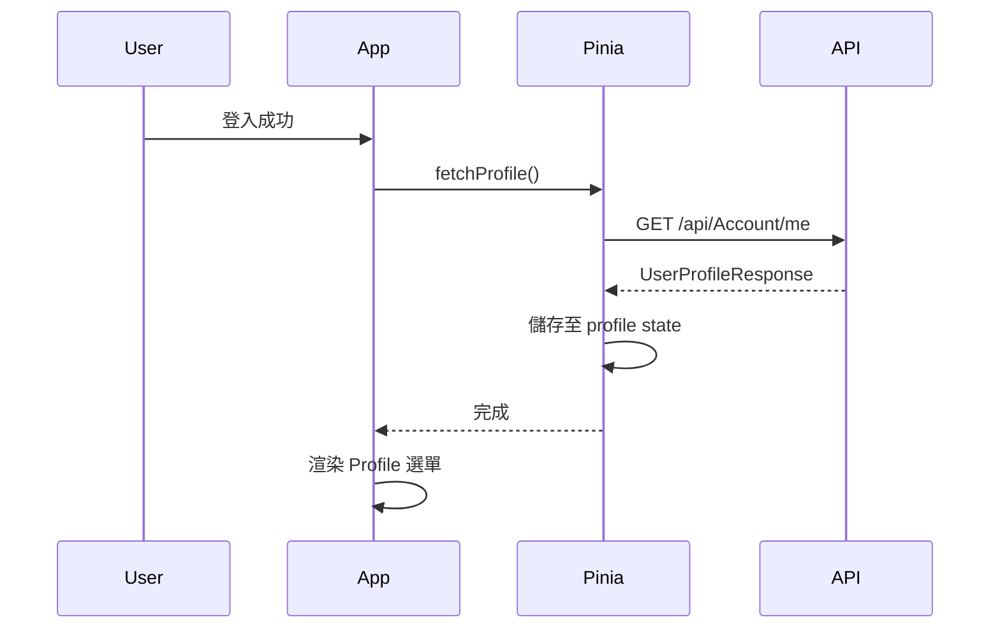
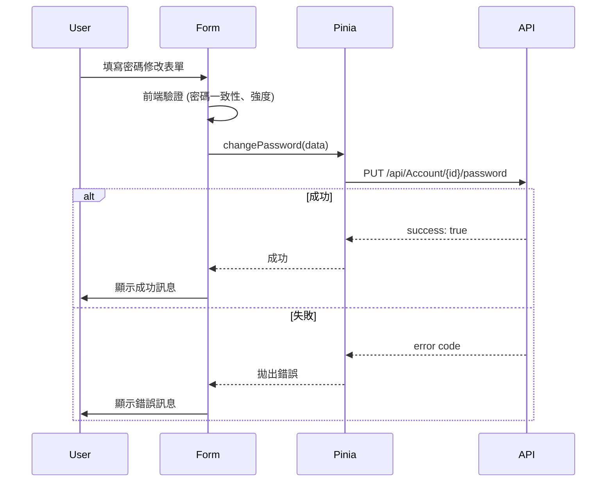
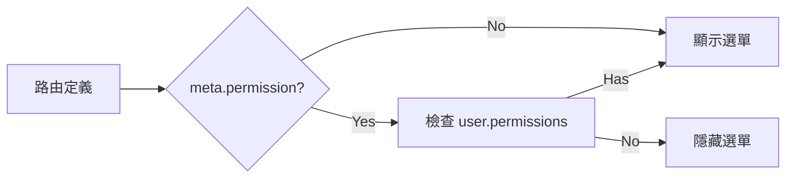

# Data Model: 用戶個人資料與選單權限管理

**Date**: 2026-01-16  
**Feature**: 004-user-profile

---

## 概述

本文件定義用戶個人資料功能所需的資料模型、狀態管理與資料流。所有型別定義遵循專案規範，使用 JSDoc 單行註解。

---

## 前端資料模型

### 1. UserProfileResponse (來自後端 API)

```typescript
/** 用戶個人資料回應 */
export interface UserProfileResponse {
  /** 帳號 */
  account: string | null
  /** 顯示名稱 */
  displayName: string | null
  /** 角色名稱清單 */
  roles: string[]
  /** 權限代碼清單 (聚合所有角色權限) */
  permissions: string[]
}
```

**說明**: 
- 對應後端 `/api/Account/me` API 回應格式
- `account` 對應前端顯示的「帳號」欄位
- `roles` 與 `permissions` 用於權限控制與選單過濾

---

### 2. ChangePasswordRequest (提交至後端 API)

```typescript
/** 變更密碼請求 */
export interface ChangePasswordRequest {
  /** 舊密碼 */
  oldPassword: string
  /** 新密碼 */
  newPassword: string
}
```

**說明**:
- 對應後端 `/api/Account/{id}/password` API 請求格式
- 前端需額外收集「確認新密碼」欄位，但不提交至後端

---

### 3. ChangePasswordFormData (前端表單)

```typescript
/** 變更密碼表單資料 */
export interface ChangePasswordFormData {
  /** 舊密碼 */
  oldPassword: string
  /** 新密碼 */
  newPassword: string
  /** 確認新密碼 */
  confirmPassword: string
}
```

**說明**:
- 前端表單專用，包含確認密碼欄位
- 提交前需驗證 `newPassword === confirmPassword`

---

## Pinia Store 狀態設計

### UserStore 擴充

```typescript
// @/pinia/stores/user.ts

/** 用戶 Store 狀態 */
interface UserState {
  /** JWT Token */
  token: string | null
  /** 用戶個人資料 */
  profile: UserProfileResponse | null
  /** Profile 載入狀態 */
  profileLoading: boolean
}

/** 用戶 Store Actions */
interface UserActions {
  /**
   * 取得用戶個人資料
   * @throws 若 API 呼叫失敗
   */
  fetchProfile(): Promise<void>
  
  /**
   * 變更密碼
   * @param data 變更密碼請求資料
   * @throws 若驗證失敗或 API 呼叫失敗
   */
  changePassword(data: ChangePasswordRequest): Promise<void>
  
  /**
   * 清除用戶資料 (登出時呼叫)
   */
  clearUser(): void
}

/** 用戶 Store Getters */
interface UserGetters {
  /** 是否已登入 */
  isLoggedIn: (state: UserState) => boolean
  
  /** 用戶顯示名稱 (優先使用 displayName，其次使用 account) */
  displayName: (state: UserState) => string
  
  /** 用戶權限清單 */
  permissions: (state: UserState) => string[]
  
  /** 檢查是否擁有特定權限 */
  hasPermission: (state: UserState) => (permission: string) => boolean
}
```

**說明**:
- 擴充現有 `user.ts` store，加入 `profile` 相關狀態與方法
- `profileLoading` 用於顯示載入指示器
- `hasPermission` 提供權限檢查輔助函式

---

## 資料流

### 1. 登入後取得 Profile



**關鍵點**:
- 登入成功後立即呼叫 `fetchProfile()`
- Profile 資料快取於 Pinia，無需重複請求

---

### 2. 修改密碼流程



**關鍵點**:
- 前端驗證減少無效請求
- 錯誤處理根據業務錯誤碼顯示對應訊息
- 其他裝置 session 由後端處理，前端無需額外操作

---

### 3. 選單權限過濾



**關鍵點**:
- Router 層級過濾，集中管理
- 依賴 `profile.permissions` 陣列
- 無權限項目不渲染於 DOM

---

## 驗證規則

### 密碼修改表單驗證

```typescript
/** 密碼修改表單驗證規則 */
const passwordRules: FormRules<ChangePasswordFormData> = {
  oldPassword: [
    { required: true, message: "請輸入舊密碼", trigger: "blur" }
  ],
  newPassword: [
    { required: true, message: "請輸入新密碼", trigger: "blur" },
    { min: 8, message: "密碼至少 8 個字元", trigger: "blur" },
    { 
      pattern: /^(?=.*[a-z])(?=.*[A-Z])(?=.*\d).{8,}$/,
      message: "密碼需包含大小寫字母與數字",
      trigger: "blur"
    }
  ],
  confirmPassword: [
    { required: true, message: "請確認新密碼", trigger: "blur" },
    {
      validator: (_rule, value, callback) => {
        if (value !== formData.value.newPassword) {
          callback(new Error("兩次密碼輸入不一致"))
        } else {
          callback()
        }
      },
      trigger: "blur"
    }
  ]
}
```

**驗證邏輯**:
1. **必填檢查**: 所有欄位均為必填
2. **密碼強度**: 至少 8 字元，包含大小寫字母與數字
3. **密碼一致性**: 新密碼與確認密碼必須相同

---

## 狀態轉換

### Profile 載入狀態

| State | Description | Actions |
|-------|-------------|---------|
| `null` | 未載入 | 登入後觸發 `fetchProfile()` |
| `loading` | 載入中 | `profileLoading = true` |
| `loaded` | 已載入 | `profile` 包含資料 |
| `error` | 載入失敗 | 顯示錯誤訊息，可重試 |

---

## 錯誤狀態處理

### API 錯誤碼對應

| Backend Code | Frontend Action | User Message |
|--------------|-----------------|--------------|
| `UNAUTHORIZED` | 導向登入頁 | 「請重新登入」 |
| `OLD_PASSWORD_INCORRECT` | 標記舊密碼欄位錯誤 | 「舊密碼不正確」 |
| `SAME_AS_OLD_PASSWORD` | 顯示警告 (不阻擋) | 「新密碼與舊密碼相同」 |
| `CONCURRENT_UPDATE_CONFLICT` | 提示重新載入 | 「資料已被修改，請重新整理」 |
| `VALIDATION_ERROR` | 顯示驗證錯誤 | 「輸入資料驗證失敗」 |
| `NOT_FOUND` | 導向錯誤頁 | 「找不到用戶資料」 |

---

## 總結

### 核心實體
1. **UserProfileResponse**: 用戶個人資料 (來自 API)
2. **ChangePasswordFormData**: 密碼修改表單 (前端)
3. **ChangePasswordRequest**: 密碼修改請求 (提交至 API)

### 狀態管理
- **Pinia Store**: 擴充 `user.ts`，管理 profile 與 loading 狀態
- **Getters**: 提供 `hasPermission` 權限檢查輔助函式

### 資料流
- 登入後載入 profile → 快取於 Pinia → 用於選單過濾與權限控制
- 密碼修改前端驗證 → API 提交 → 成功回饋 → 其他裝置 session 失效 (後端處理)

### 驗證
- 前端: 必填、密碼強度、密碼一致性
- 後端: 舊密碼驗證、業務邏輯檢查、樂觀鎖定
