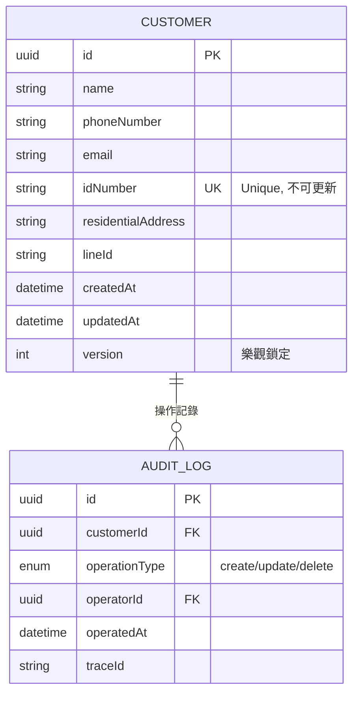

# Data Model: 客戶管理模組

**Branch**: `006-customer-management` | **Date**: 2026-01-28  
**Purpose**: 定義前端資料模型、狀態管理與欄位驗證規則

---

## Core Entities

### 1. Customer（客戶實體）

客戶實體是系統的核心資料模型，包含客戶的基本資訊與系統管理欄位。

```typescript
/**
 * 客戶實體
 * 對應後端 API: GET /api/customers/:id
 */
export interface Customer {
  /** 客戶唯一識別碼（UUID） */
  id: string
  
  /** 客戶姓名（必填，1-100 字元） */
  name: string
  
  /** 聯絡電話（必填，台灣手機格式：10 字元） */
  phoneNumber: string
  
  /** 電子郵件（選填，最多 100 字元，需符合 email 格式） */
  email: string | null
  
  /** 身分證字號/外籍人士格式（必填，10 字元） */
  idNumber: string
  
  /** 居住地址（必填，1-200 字元） */
  residentialAddress: string
  
  /** LINE ID（選填，最多 50 字元） */
  lineId: string | null
  
  /** 建立時間（ISO 8601 格式，UTC） */
  createdAt: string
  
  /** 最後更新時間（ISO 8601 格式，UTC，可為 null） */
  updatedAt: string | null
  
  /** 資料版本號（用於樂觀鎖定，從 1 開始） */
  version: number
}
```

#### 欄位說明與業務規則

| 欄位 | 型別 | 必填 | 驗證規則 | 業務規則 |
|------|------|------|---------|---------|
| `id` | UUID | ✅ | UUID v4 格式 | 後端生成，前端唯讀 |
| `name` | string | ✅ | 1-100 字元 | 支援中文、英文、數字 |
| `phoneNumber` | string | ✅ | 10 字元 | 台灣手機格式（09xxxxxxxx） |
| `email` | string\|null | ❌ | 標準 email 格式，最多 100 字元 | 選填，用於線上簽章通知 |
| `idNumber` | string | ✅ | 台灣身分證格式（2 碼英文 + 8 碼數字） | 執行檢查碼演算法驗證，新增後不可修改 |
| `residentialAddress` | string | ✅ | 1-200 字元 | 支援中文地址格式 |
| `lineId` | string\|null | ❌ | 最多 50 字元 | 選填，用於客戶聯繫 |
| `createdAt` | string | ✅ | ISO 8601 (UTC) | 後端生成，前端唯讀 |
| `updatedAt` | string\|null | ❌ | ISO 8601 (UTC) | 後端生成，前端唯讀 |
| `version` | number | ✅ | 整數 ≥ 1 | 每次更新後端自動遞增 |

---

## Request/Response DTOs

### 2. CreateCustomerRequest（新增客戶請求）

```typescript
/**
 * 新增客戶請求模型
 * 對應後端 API: POST /api/customers
 */
export interface CreateCustomerRequest {
  /** 客戶姓名（必填，1-100 字元） */
  name: string
  
  /** 聯絡電話（必填，10 字元） */
  phoneNumber: string
  
  /** 電子郵件（選填，最多 100 字元） */
  email?: string
  
  /** 身分證字號（必填，10 字元） */
  idNumber: string
  
  /** 居住地址（必填，1-200 字元） */
  residentialAddress: string
  
  /** LINE ID（選填，最多 50 字元） */
  lineId?: string
}
```

#### 前端表單驗證規則

```typescript
import type { FormRules } from 'element-plus'
import { validateTaiwanIdNumber } from '@@/utils/id-number-validator'

export const createCustomerRules: FormRules = {
  name: [
    { required: true, message: '請輸入客戶姓名', trigger: 'blur' },
    { min: 1, max: 100, message: '長度 1-100 字元', trigger: 'blur' }
  ],
  phoneNumber: [
    { required: true, message: '請輸入聯絡電話', trigger: 'blur' },
    { pattern: /^09\d{8}$/, message: '請輸入正確的台灣手機號碼（09開頭）', trigger: 'blur' }
  ],
  email: [
    { type: 'email', message: '請輸入正確的電子郵件格式', trigger: 'blur' },
    { max: 100, message: '電子郵件最多 100 字元', trigger: 'blur' }
  ],
  idNumber: [
    { required: true, message: '請輸入身分證字號', trigger: 'blur' },
    { 
      validator: (_rule, value, callback) => {
        if (!validateTaiwanIdNumber(value)) {
          callback(new Error('請輸入正確的身分證字號格式'))
        } else {
          callback()
        }
      },
      trigger: 'blur'
    }
  ],
  residentialAddress: [
    { required: true, message: '請輸入居住地址', trigger: 'blur' },
    { min: 1, max: 200, message: '長度 1-200 字元', trigger: 'blur' }
  ],
  lineId: [
    { max: 50, message: 'LINE ID 最多 50 字元', trigger: 'blur' }
  ]
}
```

---

### 3. UpdateCustomerRequest（更新客戶請求）

```typescript
/**
 * 更新客戶請求模型
 * 對應後端 API: PUT /api/customers/:id
 * 注意：身分證字號不可更新
 */
export interface UpdateCustomerRequest {
  /** 客戶姓名（必填） */
  name: string
  
  /** 聯絡電話（必填） */
  phoneNumber: string
  
  /** 電子郵件（選填） */
  email?: string
  
  /** 居住地址（必填） */
  residentialAddress: string
  
  /** LINE ID（選填） */
  lineId?: string
  
  /** 資料版本號（必填，用於樂觀鎖定） */
  version: number
}
```

#### 樂觀鎖定邏輯

```typescript
// 更新流程
async function updateCustomer(id: string, data: UpdateCustomerRequest) {
  try {
    const response = await api.updateCustomer(id, data)
    
    if (response.success) {
      ElMessage.success('更新成功')
      return response.data
    }
  } catch (error) {
    if (error.response?.status === 409) {
      // HTTP 409 Conflict: 並發衝突
      await ElMessageBox.alert(
        '此客戶資料已被其他使用者修改，請重新載入最新資料後再試',
        '資料衝突',
        { type: 'warning', confirmButtonText: '重新載入' }
      )
      throw new Error('CONCURRENT_UPDATE_CONFLICT')
    }
    throw error
  }
}
```

---

### 4. CustomerListParams（列表查詢參數）

```typescript
/**
 * 客戶列表查詢參數
 * 對應後端 API: GET /api/customers/search
 */
export interface CustomerListParams {
  /** 頁碼（從 1 開始） */
  pageNumber: number
  
  /** 每頁筆數（1-100，預設 20） */
  pageSize: number
  
  /** 搜尋關鍵字（選填，模糊比對姓名/電話/Email/身分證字號） */
  keyword?: string
}
```

#### 分頁狀態管理

```typescript
// composables/useCustomerManagement.ts
export function useCustomerManagement() {
  const pagination = ref({
    pageNumber: 1,
    pageSize: 20,
    total: 0
  })
  
  const searchKeyword = ref('')
  
  async function fetchCustomers() {
    const params: CustomerListParams = {
      pageNumber: pagination.value.pageNumber,
      pageSize: pagination.value.pageSize,
      keyword: searchKeyword.value || undefined
    }
    
    const response = await api.searchCustomers(params)
    
    if (response.success) {
      customers.value = response.data || []
      pagination.value.total = response.totalCount
    }
  }
  
  // 搜尋防抖（500ms）
  const debouncedSearch = debounce(() => {
    pagination.value.pageNumber = 1
    fetchCustomers()
  }, 500)
  
  watch(searchKeyword, () => {
    debouncedSearch()
  })
}
```

---

### 5. AI 辨識型別

#### IdCardRecognitionResponse（Gemini AI 辨識結果）

```typescript
/**
 * 身分證辨識結果（Gemini AI）
 * 對應後端 API: POST /api/ocr/id-card-multi
 */
export interface IdCardRecognitionResponse {
  /** 姓名（可能為 null） */
  name: string | null
  
  /** 身分證字號/居留證號（可能為 null） */
  idNumber: string | null
  
  /** 戶籍地址（可能為 null） */
  address: string | null
}
```

---

## State Management (Pinia)

### 客戶管理 Store（選填）

```typescript
// pinia/stores/customer.ts
import { defineStore } from 'pinia'

/**
 * 客戶管理狀態存儲
 * 注意：本專案採用 Composition API + Composables 模式
 * Pinia Store 僅在需要跨頁面共享狀態時使用
 */
export const useCustomerStore = defineStore('customer', () => {
  // 當前選中的客戶（若需跨元件共享）
  const selectedCustomer = ref<Customer | null>(null)
  
  // 快取列表（若需避免重複請求）
  const cachedCustomers = ref<Customer[]>([])
  const cacheTimestamp = ref<number>(0)
  const CACHE_DURATION = 5 * 60 * 1000  // 5 分鐘
  
  function isCacheValid(): boolean {
    return Date.now() - cacheTimestamp.value < CACHE_DURATION
  }
  
  function setCachedCustomers(customers: Customer[]): void {
    cachedCustomers.value = customers
    cacheTimestamp.value = Date.now()
  }
  
  function clearCache(): void {
    cachedCustomers.value = []
    cacheTimestamp.value = 0
  }
  
  return {
    selectedCustomer,
    cachedCustomers,
    isCacheValid,
    setCachedCustomers,
    clearCache
  }
})
```

**注意**: 根據專案現有架構（參考 user-management），若不需跨頁面共享狀態，建議直接使用 Composables 而非 Pinia Store。

---

## UI Display Models

### 列表顯示模型

```typescript
/**
 * 客戶列表顯示模型（用於表格）
 */
export interface CustomerTableRow {
  id: string
  name: string
  phoneNumber: string
  email: string
  maskedIdNumber: string      // 遮罩後的身分證字號（前4碼+******）
  residentialAddress: string
  lineId: string
  createdAt: string           // 格式化後的日期時間
}

/**
 * 將 Customer 轉換為 CustomerTableRow
 */
export function toCustomerTableRow(customer: Customer): CustomerTableRow {
  return {
    id: customer.id,
    name: customer.name,
    phoneNumber: customer.phoneNumber,
    email: customer.email || '-',
    maskedIdNumber: maskIdNumber(customer.idNumber),
    residentialAddress: customer.residentialAddress,
    lineId: customer.lineId || '-',
    createdAt: formatDateTime(customer.createdAt)
  }
}

/**
 * 遮罩身分證字號（前4碼+******）
 */
function maskIdNumber(idNumber: string): string {
  if (idNumber.length !== 10) return idNumber
  return idNumber.substring(0, 4) + '******'
}

/**
 * 格式化日期時間（ISO 8601 -> 台灣時間）
 */
function formatDateTime(isoString: string): string {
  return new Date(isoString).toLocaleString('zh-TW', {
    year: 'numeric',
    month: '2-digit',
    day: '2-digit',
    hour: '2-digit',
    minute: '2-digit'
  })
}
```

---

## Data Flow Diagram

```text
┌─────────────────────────────────────────────────────────────────────┐
│                        Customer Management                            │
└─────────────────────────────────────────────────────────────────────┘

┌──────────────┐      fetchCustomers()      ┌──────────────┐
│              │ ─────────────────────────> │              │
│  index.vue   │                             │  Backend API │
│   (主頁面)    │ <───────────────────────── │              │
│              │    ApiResponse<Customer[]>  └──────────────┘
└──────┬───────┘
       │
       │ emit('edit', customer)
       ▼
┌──────────────┐      setupEdit(customer)   ┌──────────────┐
│ CustomerForm │ ─────────────────────────> │ useCustomerForm│
│  (表單元件)   │                             │  (組合式函式) │
│              │ <───────────────────────── │              │
└──────┬───────┘    formData, rules, submit └──────────────┘
       │
       │ emit('success')
       ▼
┌──────────────┐
│  index.vue   │ ─────> refresh list
│              │
└──────────────┘

AI 辨識流程：
┌──────────────┐   upload images    ┌──────────────┐   multipart   ┌──────────────┐
│IdCardUpload  │ ─────────────────> │ useIdCardOcr │ ────────────> │ Gemini AI    │
│ (上傳元件)    │                     │  (組合式函式) │               │  (後端 API)  │
│              │ <───────────────── │              │               └──────────────┘
└──────────────┘                     └──────┬───────┘
                                            │ IdCardRecognitionResponse
                                            │ fill form fields
                                            ▼
                                      ┌──────────────┐
                                      │ CustomerForm │
                                      │  (表單元件)   │
                                      └──────────────┘
```

---

## Entity Relationships



**說明**:
- 客戶資料獨立存在，不與其他模組（如服務單）直接關聯（由服務單模組維護關聯）
- 稽核日誌（Audit Log）記錄所有 CRUD 操作，但不記錄欄位變更細節
- `idNumber` 設定為 Unique Key，新增時需檢查重複

---

## Validation Summary

### 前端驗證層級

| 驗證類型 | 時機 | 工具 | 範例 |
|---------|------|------|------|
| 格式驗證 | 即時（blur/change） | Element Plus Form Rules | 身分證格式、Email 格式 |
| 業務邏輯驗證 | 提交前 | 自訂 validator | 身分證檢查碼演算法 |
| 檔案驗證 | 上傳前 | 自訂函式 | 檔案類型、大小限制 |
| 重複檢查 | 提交後（後端回應） | API 回應處理 | 身分證字號重複 |
| 並發檢查 | 提交後（後端回應） | version 欄位 | 樂觀鎖定衝突 |

### 驗證錯誤處理優先順序

1. **前端即時驗證** - 格式錯誤立即標示
2. **後端業務驗證** - 提交後顯示 ElMessage
3. **並發衝突** - 顯示 ElMessageBox 並要求重新載入
4. **系統錯誤** - 顯示友善錯誤訊息與 traceId

---

**Next Steps**:
- ✅ Data Model 定義完成
- ➡️ 進入 Phase 1：生成 API 合約文件（contracts/）
