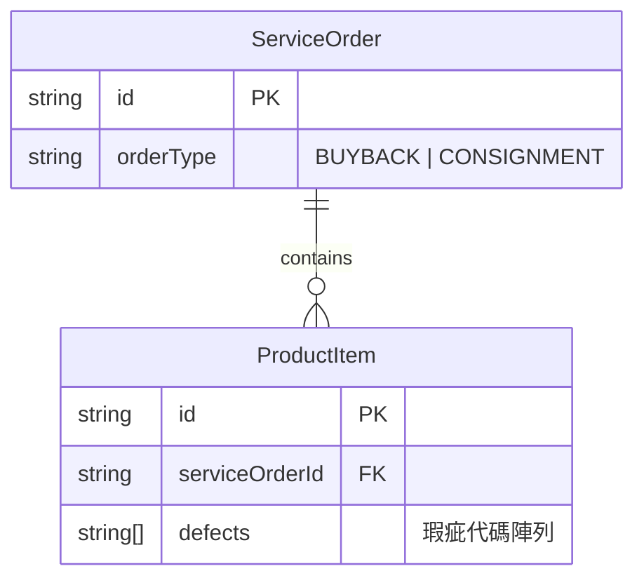

# Data Model: 收購單瑕疵欄位

**Feature**: 007-buyback-defect  
**Date**: 2026-01-30  
**Status**: Design Phase

## Overview

本功能為既有 `ProductItem` 實體擴展瑕疵欄位支援，使收購單的商品項目能夠記錄商品瑕疵狀況。資料模型變更範圍小，主要為新增選填屬性，不影響既有資料結構。

## Entity Changes

### ProductItem (擴展)

**位置**: `src/pages/service-order-management/types.ts`

**說明**: 商品項目實體，同時用於收購單與寄賣單。本次變更為確保收購單也能使用 `defects` 屬性。

#### 屬性定義

| 屬性名稱 | 型別 | 必填 | 說明 | 變更類型 |
|---------|------|------|------|---------|
| `id` | `string` | 否 | UUID 唯一識別碼 | 既有 |
| `serviceOrderId` | `string` | 否 | 所屬服務單 ID | 既有 |
| `brandName` | `string` | 是 | 品牌名稱 | 既有 |
| `style` | `string` | 是 | 款式 | 既有 |
| `internalCode` | `string` | 否 | 內碼 | 既有 |
| `grade` | `string` | 否 | 商品等級（N/NA/A/B/C） | 既有 |
| `accessories` | `string[]` | 否 | 商品配件代碼陣列 | 既有 |
| **`defects`** | **`string[]`** | **否** | **商品瑕疵代碼陣列** | **✨ 擴展用途** |
| `amount` | `number` | 是 | 金額（收購金額或實拿金額） | 既有 |

**註**: `defects` 屬性已存在於型別定義中，但註釋標記為「僅寄賣單」。本次變更為移除此限制，使收購單也能使用。

#### 瑕疵代碼 (Defect Codes)

瑕疵資訊以**固定代碼**儲存，前端透過常數對應表轉換為顯示名稱。

| 代碼 (value) | 顯示名稱 (label) | 說明 |
|--------------|-----------------|------|
| `hardwareRustScratchLoss` | 五金生鏽/刮痕/掉 | 金屬部件的鏽蝕、刮傷或遺失 |
| `leatherWearScratchDent` | 皮質磨損/刮痕/壓痕 | 皮革材質的磨損、刮傷或凹痕 |
| `liningDirty` | 內裡髒污 | 內襯布料的污漬或髒污 |
| `cornerWear` | 四角磨損 | 包包四個角落的磨損 |

**資料規則**:
- 空陣列 `[]` 表示「已確認無瑕疵」
- `undefined` 表示「未填寫」（既有記錄或未提供）
- 允許多選（0-4 個瑕疵項目）
- 儲存順序不影響業務邏輯

#### 驗證規則 (Validation Rules)

```typescript
// 前端驗證
defects?: {
  type: Array,
  validator: (value: string[]) => {
    const validCodes = ['hardwareRustScratchLoss', 'leatherWearScratchDent', 'liningDirty', 'cornerWear']
    return value.every(code => validCodes.includes(code))
  },
  message: "瑕疵代碼不合法"
}
```

**驗證要點**:
- ✅ 非必填欄位（optional）
- ✅ 必須為陣列型別
- ✅ 陣列元素必須為有效的瑕疵代碼
- ✅ 允許空陣列
- ❌ 不允許重複的瑕疵代碼（前端去重）

#### 關聯關係



- **關聯類型**: 一對多 (1:N)
- **擁有方**: `ServiceOrder` (服務單)
- **從屬方**: `ProductItem` (商品項目)
- **基數**: 一個服務單可包含 1-4 個商品項目

---

## Type Definitions Update

### CreateBuybackProductItemRequest (修改)

**位置**: `src/pages/service-order-management/types.ts`

**變更內容**: 新增 `defects` 屬性

```typescript
/** 建立收購單商品項目請求 */
export interface CreateBuybackProductItemRequest {
  /** 商品序號 (1-4) */
  sequenceNumber: number
  /** 品牌名稱 */
  brandName: string
  /** 款式 */
  styleName?: string
  /** 內碼 */
  internalCode?: string
  /** 配件列表 */
  accessories?: string[]
  /** 瑕疵列表 */  // ✨ 新增
  defects?: string[]  // ✨ 新增
}
```

**影響範圍**: 
- API 請求型別定義
- 表單提交邏輯（`useServiceOrderForm.ts`）

---

## Constants Update

### DEFECT_OPTIONS (確認既有)

**位置**: `src/pages/service-order-management/types.ts`

**說明**: 瑕疵選項常數定義，既有內容無需修改，確認收購單可共用。

```typescript
/** 商品瑕疵選項 */
export const DEFECT_OPTIONS = [
  { label: "五金生鏽/刮痕/掉", value: "hardwareRustScratchLoss" },
  { label: "皮質磨損/刮痕/壓痕", value: "leatherWearScratchDent" },
  { label: "內裡髒污", value: "liningDirty" },
  { label: "四角磨損", value: "cornerWear" }
] as const
```

**使用方式**:
- 表單元件：Checkbox 群組選項來源
- 顯示轉換：代碼轉換為顯示標籤
- 驗證：有效代碼白名單

---

## Data Migration

### Migration Strategy: 不需要資料遷移 ✅

**理由**:
1. `defects` 為選填欄位（optional），既有記錄無此欄位不影響系統運作
2. 前端自動將 `undefined` 視為空陣列處理
3. 後端 API 應支援向後相容（既有記錄回傳時不包含 defects 欄位或回傳 null）

**既有資料處理**:
```typescript
// 查詢時的容錯處理
const defects = productItem.defects ?? []

// 顯示時的判斷
if (!defects || defects.length === 0) {
  return "-"  // 或「無」
}
```

**測試情境**:
- ✅ 新建收購單填寫瑕疵 → 正常儲存與顯示
- ✅ 新建收購單不填寫瑕疵 → 儲存為空陣列或 undefined
- ✅ 查詢既有收購單（無 defects） → 顯示「-」或「無」
- ✅ 編輯既有收購單新增瑕疵 → 從 undefined 更新為陣列

---

## Database Schema (參考)

> **注意**: 本前端專案不直接管理資料庫，以下為後端資料庫結構參考。

### ProductItems 表 (預期後端結構)

```sql
CREATE TABLE ProductItems (
    Id UNIQUEIDENTIFIER PRIMARY KEY,
    ServiceOrderId UNIQUEIDENTIFIER NOT NULL,
    BrandName NVARCHAR(100) NOT NULL,
    Style NVARCHAR(100),
    InternalCode NVARCHAR(50),
    Grade NVARCHAR(10),
    Accessories NVARCHAR(MAX),  -- JSON array
    Defects NVARCHAR(MAX),      -- JSON array (新增或既有)
    Amount DECIMAL(18, 2) NOT NULL,
    FOREIGN KEY (ServiceOrderId) REFERENCES ServiceOrders(Id)
);
```

**Defects 欄位**:
- **型別**: `NVARCHAR(MAX)` 或 `JSONB`（依後端實作）
- **儲存格式**: JSON 字串陣列，例如 `["hardwareRustScratchLoss", "leatherWearScratchDent"]`
- **空值處理**: `NULL` 或 `"[]"`（取決於後端實作）
- **索引**: 不建議建立索引（非查詢欄位）

---

## State Management

### Pinia Store (無需修改)

**說明**: 本功能不涉及全域狀態管理，所有資料處理在元件層級完成。

**資料流向**:
```
元件表單 (ProductItemForm.vue)
  ↓ emit('submit')
Composable (useServiceOrderForm.ts)
  ↓ API 請求
後端 API
  ↓ 回傳結果
元件更新 / 路由跳轉
```

---

## API Contract Changes

詳細 API 契約變更請參考 `contracts/api-updates.md`。

**Summary**:
- **POST** `/api/service-orders/buyback` → Request 新增 `productItems[].defects`
- **GET** `/api/service-orders/{id}` → Response 的 `productItems[].defects` 既有欄位確認可用
- **PUT** `/api/service-orders/{id}` → Request 新增商品項目 `defects` 支援（如適用編輯功能）

---

## Backward Compatibility

### 相容性檢查清單

| 情境 | 處理方式 | 測試狀態 |
|------|---------|---------|
| 既有收購單（無 defects） | 顯示 "-" 或「無」 | ⏳ Pending |
| 既有寄賣單（有 defects） | 正常顯示 | ✅ 既有功能 |
| 新建收購單（不填瑕疵） | 儲存空陣列或 undefined | ⏳ Pending |
| 新建收購單（填瑕疵） | 正常儲存與顯示 | ⏳ Pending |
| 編輯既有收購單 | 允許新增/修改瑕疵 | ⏳ Pending |
| Excel 匯出既有記錄 | 顯示空白或「無」 | ⏳ Pending |

**破壞性變更**: 無 ✅

---

## Performance Considerations

### 資料量估算

- 單一服務單最多 4 個商品項目
- 單一商品項目最多 4 個瑕疵項目
- 瑕疵代碼平均長度：20 字元
- **最大資料大小**: 4 × 4 × 20 = 320 bytes (可忽略不計)

### 效能影響

- ✅ 資料量小，不影響載入效能
- ✅ 不需要額外的資料庫查詢
- ✅ 前端驗證與轉換邏輯簡單，無效能瓶頸
- ✅ Excel 匯出新增一個欄位，影響可忽略

---

## Security Considerations

### 資料驗證

- ✅ 前端驗證瑕疵代碼在白名單內
- ✅ 後端必須獨立驗證（不信任前端資料）
- ✅ 防止 SQL Injection（後端使用參數化查詢）
- ✅ 防止 XSS（Element Plus 自動轉義）

### 權限控制

- 瑕疵資訊與商品項目權限一致
- 無需額外的權限控制邏輯

---

## Testing Requirements

### 單元測試

- [ ] 瑕疵代碼轉換工具函式（`getDefectLabel`）
- [ ] 表單驗證邏輯（defects 欄位）
- [ ] Excel 匯出格式轉換（`formatDefectsForExcel`）

### 整合測試

- [ ] 建立收購單（含瑕疵資訊）→ API 請求正確
- [ ] 建立收購單（不含瑕疵）→ API 請求正確
- [ ] 查詢既有收購單（無瑕疵欄位）→ 顯示正常
- [ ] 查詢新收購單（有瑕疵欄位）→ 顯示正確

### E2E 測試

- [ ] 完整建單流程（選擇瑕疵 → 提交 → 查詢）
- [ ] Excel 匯出包含瑕疵欄位

---

## References

- Feature Spec: `specs/007-buyback-defect/spec.md`
- Research Document: `specs/007-buyback-defect/research.md`
- Type Definitions: `src/pages/service-order-management/types.ts`
- API Specification: `V3.Admin.Backend.API.yaml` (後端規範)

---

**Data Model Status**: ✅ Complete  
**Ready for Implementation**: ✅ Yes  
**Blockers**: 需確認後端 API 規範是否已包含此變更
